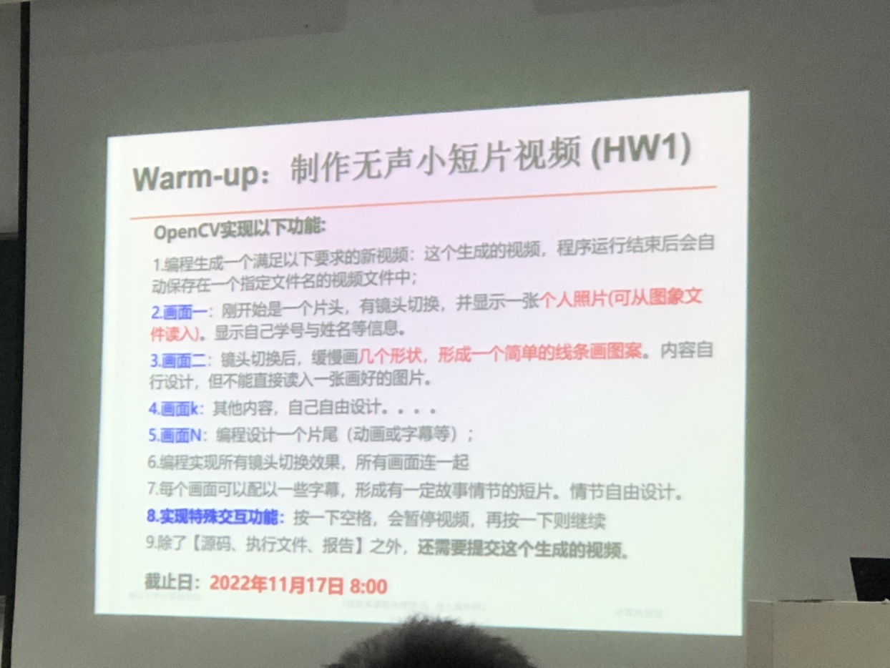

# CV-Labs

## 安装 & 环境

> 开发环境：VScode + WSL2 + Opencv + VcXsrv

安装Opencv

``` bash
# Install minimal prerequisites (Ubuntu 18.04 as reference)
sudo apt update && sudo apt install -y cmake g++ wget unzip
# Download and unpack sources
wget -O opencv.zip https://github.com/opencv/opencv/archive/4.x.zip
unzip opencv.zip
# Create build directory
mkdir -p build && cd build
# Configure
cmake  ../opencv-4.x
# Build
cmake --build .
# Install
make install
```

安装VcXsrv

> VcXsrv是一个开源软件，它可以为wsl的程序提供GUI窗口。

+ [下载](https://sourceforge.net/projects/vcxsrv/)安装包

+ 配置WSL环境

``` bash
# Edit config for console
vim ~/.bashrc or vim ~/.zshrc
# Add following to the end of file
export DISPLAY=$(cat /etc/resolv.conf | grep nameserver | awk '{print $2}'):0
# Save and put the config into work
source ~/.bashrc or source ~/.zshrc
```

+ 启动VcXsrv: 在安装目录，双击xlaunch启动服务。

## 运行 & 检查

``` bash
cd labs
mkdir build | cd build
cmake ../
make lab1 or lab2 or lab3
./lab1 or ./lab2 or ./lab3
```

## 要求 & 实现

### Lab1 Warm-up



## References

安装

+ [opencv 官网安装](https://docs.opencv.org/4.x/d7/d9f/tutorial_linux_install.html)
+ [opencv 安装](https://starrycat.me/wsl-1-opencv-compile-install-using-cmake.html)

运行

+ [stack over flow](https://stackoverflow.com/questions/63455427/fatal-error-opencv2-opencv-modules-hpp-no-such-file-or-directory-include-ope)
